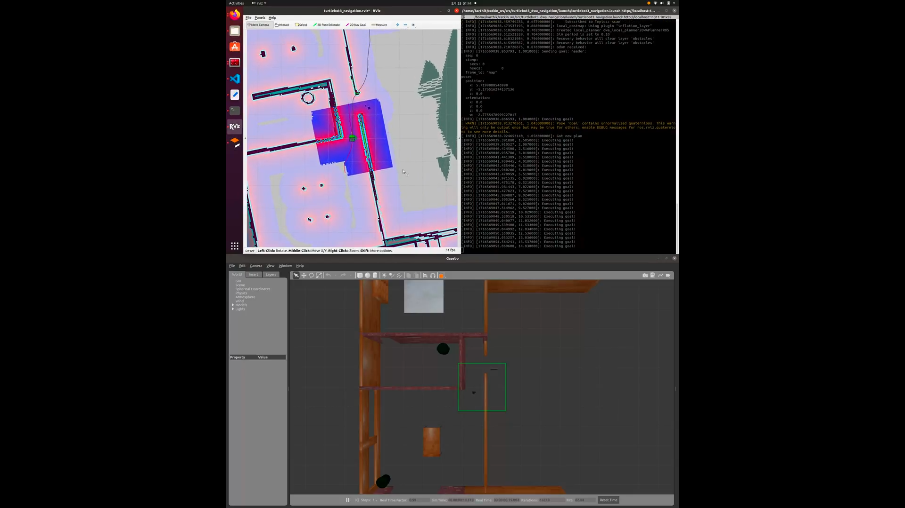

# Turtlebot3 DWA Navigation

## Overview
This ROS package provides a simple goal publisher node for Turtlebot3 using the Dynamic Window Approach (DWA) navigation algorithm. It randomly generates goals within the free space of the map and sends them to the move_base node for navigation.

## Prerequisites
- ROS installed on your system (tested with ROS Noetic)
- Turtlebot3 simulation environment (e.g., Gazebo) set up and running
- move_base
- Dependencies:
  - geometry_msgs
  - actionlib_msgs
  - nav_msgs
  - tf

## Installation
1. Clone this repository into your catkin workspace:
  ```cpp
  cd ~/catkin_ws/src
  git clone https://github.com/lastVIZSLA/turtlebot3_dwa_navigation.git
  ```

2. Build the package:
```cpp
cd ~/catkin_ws
catkin_make
```


## Usage
1. Launch the Turtlebot3 simulation environment. For example:

```cpp
roslaunch turtlebot3_dwa_navigation turtlebot3_navigation.launch
```

2. The robot will start moving to random goal positions within the map.

## Parameters
- `rate` (default: 10): Rate at which goals are published (in Hz).

[](https://drive.google.com/file/d/1v05vymSoCzGh4OFPhls-d60dnp7KTmab/view?usp=sharing)

